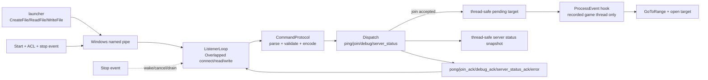

# ExternalCommandPipe C++ function/structure/code analysis guide

English | [简体中文](command-framework-code-analysis.zh-CN.md)

This is the code-level maintenance guide for the current named-pipe implementation. It
describes the refactored behavior, not the intent of an older revision. For the concise
wire contract, see the [named-pipe command protocol](command-framework.md).

The guide is organized around four review questions: who owns each object and handle,
which thread calls each function, which lock protects each state transition, and what
state remains after failure.

## 1. Code boundary

| File | Responsibility | Dependency boundary |
| --- | --- | --- |
| `ProjectReboundMainDLL/API/CommandProtocol.h/.cpp` | Constants, request values, parsing, encoding, target validation | Portable C++ |
| `ProjectReboundMainDLL/API/ExternalCommandPipe.h/.cpp` | ACL, pipe, Overlapped I/O, lifecycle, dispatch | Windows |
| `ProjectReboundMainDLL/Client/AutoConnect.h/.cpp` | Thread-safe join queue and game-thread state machine | Windows and Unreal SDK |
| `ProjectReboundMainDLL/Hooking/ClientHooks.cpp` | Login thread identity and post-`ProcessEvent` command pump | Unreal hook |
| `ProjectReboundMainDLL/Core/Entry.cpp` | Dependency injection, startup, explicit shutdown export | Windows DLL |
| `ProjectReboundMainDLL/Tests/CommandProtocolTests.cpp` | Parser, validator, and encoder boundaries | Portable |
| `ProjectReboundMainDLL/Tests/ExternalCommandPipeTests.cpp` | Real Windows pipe integration | Windows |
| `ProjectReboundMainDLL/Tests/CMakeLists.txt` | Isolated test build | CMake |

Both API sources are explicit items in `ProjectReboundMainDLL/Payload.vcxproj`. The protocol
can therefore be tested without compiling the generated Unreal SDK while remaining part
of the production DLL.

## 2. Architecture



The listener thread handles bytes, JSON, queue admission, and reads of the synchronized
server-status snapshot only. Join-related Unreal object access and console execution occur
on the exact thread recorded by the login event; `server_status` never dereferences Unreal
objects on the listener thread.

## 3. Protocol value structures

### Limits

| Constant | Value | Applies to |
| --- | ---: | --- |
| `Delimiter` | Tab | Command/JSON separator |
| `Newline` | LF | Frame terminator |
| `MaxFrameBytes` | 64 KiB | Complete wire frame, including LF |
| `MaxCommandBytes` | 32 | Command bytes |
| `MaxRequestIdBytes` | 128 | `request_id` bytes |
| `MaxMatchTargetBytes` | 512 | `join.ip` bytes |
| `MaxTokenBytes` | 4096 | `join.token` bytes |

Limits count bytes, not Unicode code points. Commands and targets use restricted ASCII;
the JSON library parses and escapes JSON strings.

### `Request`

`Request` owns its `command`, object-valued `arguments`, and optional validated
`requestId`. It does not retain a view into the read buffer, so erasing or reallocating
that buffer cannot invalidate a dispatched request.

### `ParseResult`

Success means `request` has a value. Failure carries a stable error code and a diagnostic
message. A request ID is attached to an error only after that ID itself has parsed and
passed type/length validation.

## 4. `ExternalCommandPipe` structure

### Callback contracts

| Callback | Meaning | Thread |
| --- | --- | --- |
| `JoinCallback` | `(target, token) -> bool`; true means queued | Listener |
| `DebugCallback` | `arguments -> json` | Listener |
| `ServerStatusCallback` | `() -> json`; returns a non-secret cached Dedicated Server snapshot | Listener |
| `LogCallback` | Receives one message without a newline | Calling thread |

The framework copies each `std::function` under `callbackMutex` and invokes the copy
after releasing the lock. User code therefore does not execute inside a framework lock.
Dispatch and logging boundaries catch callback exceptions.

### `UniqueHandle`

The nested move-only RAII type closes every valid owned Win32 handle. It owns the pipe,
stop event, operation events, process handles, and token handles. `hCurrentPipe` is the
one exception: it is a non-owning alias, protected by `writeMutex`; the `UniqueHandle`
local in `ListenerLoop` is the real owner.

### I/O and frame state

`IoStatus` distinguishes completed, timed out, stopped, and failed operations. An
`ERROR_MORE_DATA` read is a completed chunk. `IoResult` preserves bytes and the Win32
error. `FrameResult` distinguishes a processed frame, a protocol violation, and a
transport failure so the read loop can apply the correct connection policy.

### Member ownership

| State | Protection/lifetime |
| --- | --- |
| Pipe name/path and timeouts | `lifecycleMutex`; immutable while running/stopping |
| `running`, `connectionFaulted`, listener thread ID | Atomics |
| `stopping`, listener thread, stop event | `lifecycleMutex` |
| Current pipe alias and complete writes | `writeMutex` |
| Callback functions | `callbackMutex` |
| Security descriptor, ACL, user SID | Built before the listener; released after Stop |

## 5. Protocol functions

### `ParseFrame(frame)`

The function rejects an empty/oversized frame, finds the first Tab, validates a
1–32-byte lowercase command, requires JSON, parses it, requires an object root, and
validates the optional request ID. The returned request owns all storage.

The function is intentionally not `noexcept`: strings and JSON allocate. The framework's
`ParseAndDispatch()` function is the exception boundary that prevents allocation/parser
exceptions from escaping the listener.

### `ValidateMatchTarget(target, failureReason)`

This is a console-injection boundary, not a DNS or socket parser. It requires 1–512
printable, non-whitespace ASCII bytes; accepts `host:port` or `[IPv6]:port`; applies a
small character allowlist; and parses a decimal port in the range 1–65535. It can accept
a lexically safe target that later fails DNS or network resolution.

### `WithRequestId(payload, requestId)`

`WithRequestId` wraps non-object callback results as `{"result": value}` and attaches
correlation while preserving object-valued results.

### `MakeError(code, message, requestId)`

`MakeError` produces stable `code` and `message` fields plus optional correlation. The
code is contractual; the diagnostic message may evolve.

### `EncodeFrame(command, payload)`

`EncodeFrame` revalidates the response command/object, serializes JSON once, appends
Tab/LF, and throws if the complete wire frame exceeds 64 KiB.

## 6. Framework functions

### Construction, destruction, and setters

Defaults are a 30-second read-idle timeout and a five-second write timeout. Destruction
calls `Stop()` before releasing security state. Setters take effect only while the object
is neither running nor stopping. Callback setters take locks in the fixed order
`lifecycleMutex` then `callbackMutex`.

### `BuildPipePath(failureReason)`

The function accepts a 1–200-byte name made of ASCII alphanumerics, `_`, `-`, or `.`,
builds `\\.\pipe\<name>`, and checks the final length. This prevents namespace/path
syntax from being smuggled through the launch argument.

### `InitializeSecurity(failureReason)`

It reads `TokenUser` from the Payload process token, copies that SID, creates an ACL that
grants read/write to that SID only, installs a present non-NULL DACL on an absolute
security descriptor, and publishes non-inheritable security attributes. The ACL returned
by `SetEntriesInAclW` is paired with `LocalFree` in `ReleaseSecurity()`.

### `Start()`

Under `lifecycleMutex`, Start verifies that no run/stop/joinable thread exists, validates
the path, initializes security, creates a manual-reset stop event, clears connection
failure, marks the object running, and creates the listener thread. It copies the name
and releases the lock before logging. Thread-creation failure rolls back running state
and the stop event.

`true` means the listener thread was created; creation of the first pipe instance happens
asynchronously in that thread.

### `Stop()`

An external owner clears `running`, signals the stop event, cancels current pipe I/O,
moves the listener thread to local ownership, marks `stopping`, releases the lifecycle
lock, joins, then reacquires the lock and clears the pipe alias/event/stopping state.
Releasing the lifecycle lock before join prevents exit-path deadlocks.

If called on the listener itself, Stop only requests cancellation; an external owner must
call Stop again to join. Production callbacks must not destroy the framework. Explicit
DLL unloading uses the exported shutdown function from an ordinary external thread.

### `IsAuthorizedClient(pipe)`

After connect, the server obtains the client PID, requires the same Windows session,
opens that process with limited query access, reads its user SID, and compares it with
the SID used in the DACL. Failure to prove any property rejects the connection.

### `CompleteIo`, `WaitForPendingIo`, and `CancelAndDrain`

These functions enforce the central lifetime invariant: an `OVERLAPPED`, its event, and
its buffer stay alive until the kernel operation reaches a terminal state.

- synchronous and asynchronous completion converge through `GetOverlappedResult`;
- pending I/O waits for either the shared stop event or its operation event;
- timeout/stop/wait failure calls `CancelIoEx`;
- a blocking `GetOverlappedResult(..., TRUE)` always drains afterward, including when
  cancellation reports `ERROR_NOT_FOUND` because completion won the race.

A configured timeout of zero maps to `INFINITE`.

### `ListenerLoop()`

Each iteration creates one duplex, Overlapped, message-mode pipe with
`FIRST_PIPE_INSTANCE`, `REJECT_REMOTE_CLIENTS`, and a maximum instance count of one. It
performs event-backed connect, authenticates the client, publishes the non-owning pipe
alias under `writeMutex`, reads one connection, removes the alias before disconnect/close,
then creates a fresh instance. Create failures wait on the stop event for one second to
avoid a busy retry loop.

Connection and top-level exception boundaries prevent C++ exceptions from crossing the
thread entry. An unexpected listener exception sets `running=false`; the owner must Stop
and join before a new Start.

### `ReadClient(pipe)`

Reads use 4096-byte chunks plus a persistent line buffer, supporting split frames and
multiple frames per read. `ERROR_MORE_DATA` contributes a valid chunk. Each LF-delimited
frame is size-checked, optional CR is removed, and parsing/dispatch runs. Transport errors
disconnect immediately; three accumulated protocol errors disconnect the client.

An unterminated buffer reaching 64 KiB produces `frame_too_large` and disconnects. The
watchdog measures idle time since the last successful read chunk, not a whole-frame
deadline.

### `SendResponse(command, payload)`

Encoding occurs before locking. Under `writeMutex`, the function validates that a pipe
is published, creates a write event, and performs one Overlapped write. Only a completed
full-frame transfer returns true. Timeout, stop, short write, or Win32 failure marks the
connection faulted and cancels its other I/O so the listener can rebuild.

### `ParseAndDispatch` and `Dispatch`

| Command | Validation/side effect | Result |
| --- | --- | --- |
| `ping` | No side effect | `pong` |
| `join` | Validate `ip`, token type/size; invoke copied Join callback | accepted `join_ack`, otherwise `busy`/`unavailable` |
| `debug` | Invoke copied Debug callback; callback owns business schema | `debug_ack` |
| `server_status` | Invoke copied Server Status callback; no request secrets or Unreal access | `server_status_ack` or `unavailable` |
| other | None | `unknown_command` |

Schema/target failures count as protocol errors. `busy` and `unavailable` are valid
business responses and do not consume the violation budget. Callback exceptions become
`internal_error`.

### `SendError`, `Log`, and `LogWin32Error`

`SendError` centralizes the stable error object. Logging copies its callback under lock
and invokes it unlocked; callback failure falls back to `OutputDebugStringA` without
terminating the listener.

## 7. Game-thread integration

### State structure

`AutoConnect.cpp` protects `pendingTarget`, `currentTarget`, stage, and deadline with
`connectMutex`. The stages are:

| Stage | Meaning | Transition |
| --- | --- | --- |
| `Idle` | No pending target | Producer queues target |
| `Queued` | Target admitted | After login, start two-second settle delay |
| `WaitingAfterLogin` | Menu settling | Call `GoToRange`, start one-second delay |
| `WaitingAfterRange` | Range travel settling | Execute `open <target>`, return Idle |

### `QueueConnectToMatch(target)`

`QueueConnectToMatch` validates before locking, admits only one pending target, unlocks,
then logs. Its bool return directly controls accepted versus busy.

### `ConnectToMatch()`

`ConnectToMatch` requeues `currentTarget` after a connection timeout; it no longer uses
hard-coded loopback.

### `AutoConnectToMatchFromCmdline()`

`AutoConnectToMatchFromCmdline` uses the same queue and no detached thread.

### `NotifyClientLoginCompleted()`

`NotifyClientLoginCompleted` records the current Windows thread ID at the main-menu
Construct event, then publishes login completion.

### `PumpPendingClientCommands()`

`PumpPendingClientCommands` runs after the original client ProcessEvent but returns unless
it is on that recorded thread. It validates World/GameInstance/LocalPlayer, advances one
timed stage, and calls Unreal outside `connectMutex`. A `thread_local` recursion guard
prevents synchronous nested ProcessEvent calls from consuming a second stage.

## 8. DLL wiring and ownership

Client startup configures a temporary `unique_ptr<ExternalCommandPipe>` and publishes a raw
process-lifetime pointer only after Start succeeds. Failed startup therefore destroys a
fully stopped object.

`ShutdownPayloadCommandFramework()` takes the global pointer under its mutex, then stops
and deletes outside that mutex. Explicit unloaders must call it on a normal thread before
unloading. Joining from `DllMain` is deliberately avoided because the Windows loader lock
can deadlock; ordinary process termination lets Windows reclaim process resources.

## 9. Concurrency and lock order

| Context | Work |
| --- | --- |
| Payload startup thread | Configure/start; queue command-line target |
| Framework listener | Accept/read/parse/dispatch/write |
| Recorded game thread | Advance join state and access Unreal |
| Any external thread | `SendResponse` and owner `Stop` |

Rules:

1. `lifecycleMutex` may be followed by `callbackMutex` or `writeMutex`; never reverse it.
2. Stop releases `lifecycleMutex` before join.
3. No user callback, log callback, or Unreal call executes under a framework mutex.
4. `writeMutex` covers both current-handle publication/removal and the entire write.
5. `connectMutex` is independent and held only for short queue/state transitions.
6. No detached thread may retain framework or Unreal state.

## 10. Security and residual threats

| Threat | Mitigation | Residual boundary |
| --- | --- | --- |
| Other local user | Current-user DACL plus post-connect SID comparison | Same-user processes remain trusted peers |
| Remote pipe access | `PIPE_REJECT_REMOTE_CLIENTS` | Host firewall policy still applies |
| Same user, other session | Client PID/session comparison | Query failure rejects closed |
| Name squatting/multiple instances | High-entropy name guidance and `FIRST_PIPE_INSTANCE` | Learned names can be occupied by same-user code |
| Console injection | Target allowlist and numeric port parser | Not DNS or reachability validation |
| Frame/memory abuse | 64 KiB cap, three-error disconnect, one connection | Same-user client can reconnect repeatedly |
| Credential theft | Token is not authentication; avoid durable secrets | No message encryption/launcher attestation |
| Debug abuse | Same-user/session boundary | Debug callback must define its own schema/policy |

## 11. Failure and recovery

| Failure | Client effect | Server state |
| --- | --- | --- |
| Invalid name/security setup | No pipe | Start false; configuration may be fixed and retried |
| Unauthorized connect | Disconnected | Fresh instance created |
| JSON/schema/target error | Structured `error` | Continue until three violations |
| Read idle timeout | Disconnected | Pipe rebuilt |
| Write timeout/short write/broken pipe | Connection lost | Read canceled and pipe rebuilt |
| Callback exception | `internal_error` | Listener continues |
| Unexpected listener C++ exception | Connection closes | running false; owner Stop/join before restart |
| Join queue occupied | `busy` | Existing target unchanged |

## 12. Test and verification matrix

### Portable protocol tests

Portable protocol tests cover valid ping/join, request correlation, malformed framing and
JSON, object/type requirements, invalid commands/IDs, exact 64 KiB boundaries, target
forms and injection, deterministic encoding, and error shape. Ubuntu CI builds them with
`-Wall -Wextra -Wpedantic -Werror`.

### Windows pipe integration tests

Windows integration tests use a real `CreateFileW` client and cover invalid names,
start/connect, correlated ping, accepted/busy join, invalid targets, restart after full
Stop, and prompt cancellation while waiting in ConnectNamedPipe. A dedicated
`windows-latest` CI job builds and runs this target with warnings as errors.

### Recommended commands

Recommended commands:

```powershell
cmake -S ProjectReboundMainDLL/Tests -B build/command-pipe-tests
cmake --build build/command-pipe-tests --config Release
ctest --test-dir build/command-pipe-tests -C Release --output-on-failure

msbuild ProjectReboundMainDLL/Payload.vcxproj /m /p:Configuration=Release /p:Platform=x64
```

Changes to identity/ACL logic should additionally be tested with two Windows users, two
sessions, and a remote-pipe attempt.

## 13. Resolved defects

| Previous defect | Current implementation |
| --- | --- |
| NULL DACL | Current-user non-NULL DACL plus identity checks |
| Incomplete Overlapped write setup | Per-operation event and unified completion |
| Cancel followed by early storage release | Unconditional cancel/drain invariant |
| Unused watchdog setting | Real read wait timeout |
| Stop timeout detached a thread capturing `this` | Stop event, CancelIoEx, deterministic join |
| Listener called Unreal directly | Queue plus recorded-game-thread pump |
| `join_ack` always reported success | Callback reports accepted/busy |
| Reconnect used hard-coded loopback | Saved current target is requeued |
| Loose JSON/field/target handling | Independent bounded protocol layer |
| No request correlation | Optional end-to-end `request_id` echo |

## 14. Known remaining constraints

- Only one client is served at a time; there is no multi-client fairness.
- `join_ack` confirms queue admission, not completion of the network connection.
- The read watchdog is a byte-idle timeout; a same-user slow sender can keep it alive.
- Target validation is a console-safety allowlist, not full DNS/IPv6/reachability proof.
- Game-thread identity depends on the main-menu Construct hook; without that event, a
  queued target waits.
- `token` is reserved and provides no authentication, replay protection, or encryption.
- Explicit DLL unload must follow the external shutdown-export contract.
- Debug business schema and authorization remain callback responsibilities.

## 15. Change checklist

1. Keep `CommandProtocol` independent of Windows and Unreal.
2. Give each new field a type, required/optional rule, byte limit, and error code.
3. Keep request and response 64 KiB accounting symmetric.
4. Drain every pending operation before releasing its OVERLAPPED/event/buffer storage.
5. Hold `writeMutex` whenever publishing, removing, or writing the current pipe handle.
6. Invoke user code only after releasing framework locks.
7. Keep every Unreal operation on the recorded game thread.
8. Send `join_ack` only after the queue actually accepts the target.
9. Test Start failure, disconnect, timeout, Stop, and restart paths.
10. Update both protocol documents, both analysis guides, launcher consumers, and tests.

Useful navigation commands:

```powershell
rg -n "ParseFrame|ValidateMatchTarget|EncodeFrame" ProjectReboundMainDLL/API
rg -n "Start\(|Stop\(|ListenerLoop|ReadClient|SendResponse" ProjectReboundMainDLL/API
rg -n "QueueConnectToMatch|NotifyClientLoginCompleted|PumpPendingClientCommands" Payload
```
