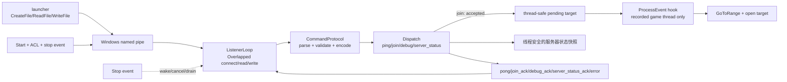

# ExternalCommandPipe C++ 函数—结构—代码分析指南

[English](command-framework-code-analysis.md) | 简体中文

本文是当前命名管道实现的代码级维护指南。它描述重构后的实际行为，而不是旧版本的设计
意图；协议摘要见[命名管道命令协议](command-framework.zh-CN.md)。阅读本文后，维护者应能
回答四个问题：对象和句柄由谁拥有、每个函数在哪个线程执行、状态受哪把锁保护、失败后
系统进入什么状态。

## 1. 代码边界与职责

| 文件 | 主要职责 | 平台依赖 |
| --- | --- | --- |
| `ProjectReboundMainDLL/API/CommandProtocol.h/.cpp` | 常量、请求结构、帧解析/编码、目标校验 | 纯 C++ |
| `ProjectReboundMainDLL/API/ExternalCommandPipe.h/.cpp` | ACL、命名管道、Overlapped I/O、生命周期、分发 | Windows |
| `ProjectReboundMainDLL/Client/AutoConnect.h/.cpp` | 线程安全加入队列、游戏线程状态机 | Windows、Unreal SDK |
| `ProjectReboundMainDLL/Hooking/ClientHooks.cpp` | 登录线程标识、`ProcessEvent` 后置命令泵 | Unreal Hook |
| `ProjectReboundMainDLL/Core/Entry.cpp` | 依赖注入、启动、显式卸载入口 | Windows DLL |
| `ProjectReboundMainDLL/Tests/CommandProtocolTests.cpp` | 纯协议边界与编码测试 | 可移植 |
| `ProjectReboundMainDLL/Tests/ExternalCommandPipeTests.cpp` | 真实 Windows 管道集成测试 | Windows |
| `ProjectReboundMainDLL/Tests/CMakeLists.txt` | 独立测试构建入口 | CMake |

`ProjectReboundMainDLL/Payload.vcxproj` 显式包含两个 API 源文件；协议层因此既可随
Payload 构建，也可脱离庞大的 SDK 单独测试。

## 2. 总体调用图



关键边界是：监听线程只处理字节、JSON、队列以及线程安全的服务器状态快照。与加入流程
相关的 Unreal 对象访问和控制台命令都在登录事件记录的游戏线程执行；`server_status`
不会在监听线程解引用 Unreal 对象。

## 3. 线上协议的数据结构

### 3.1 常量

`CommandProtocol` 定义以下硬限制：

| 常量 | 值 | 约束对象 |
| --- | ---: | --- |
| `Delimiter` | Tab | 命令与 JSON 分隔 |
| `Newline` | LF | 帧结束符 |
| `MaxFrameBytes` | 64 KiB | 包含 LF 的完整线上帧 |
| `MaxCommandBytes` | 32 | 命令字节数 |
| `MaxRequestIdBytes` | 128 | `request_id` 字节数 |
| `MaxMatchTargetBytes` | 512 | `join.ip` 字节数 |
| `MaxTokenBytes` | 4096 | `join.token` 字节数 |

大小按字节计算，不按 Unicode 字符数计算。命令和比赛目标只接受受限 ASCII；JSON 字符串由
JSON 库负责解析和转义。

### 3.2 `Request`

`Request` 是解析成功后的不可共享值对象：

- `command`：规范化前不会修改，语法已经验证；
- `arguments`：保证是 JSON 对象；
- `requestId`：缺省或已验证的非空字符串。

对象按值传给分发器，不保存输入缓冲区的 `string_view`，因此读缓冲区移动或清空不会让请求
悬空。

### 3.3 `ParseResult`

成功时 `request` 有值；失败时 `errorCode` 和 `errorMessage` 有值。只有已经成功解析且合法的
`request_id` 才可能放入失败响应，畸形 ID 不会被回显。`Succeeded()` 只检查 `request`，是
调用方唯一需要使用的成功判定。

## 4. `ExternalCommandPipe` 类结构

### 4.1 公共回调

| 类型 | 签名语义 | 执行线程 |
| --- | --- | --- |
| `JoinCallback` | `(target, token) -> bool`；`true` 表示已排队 | 监听线程 |
| `DebugCallback` | `arguments -> json` | 监听线程 |
| `ServerStatusCallback` | `() -> json`；返回不含秘密的 Dedicated Server 缓存快照 | 监听线程 |
| `LogCallback` | 输出一条不带换行的消息 | 调用日志的线程 |

框架会在持锁时复制 `std::function`，释放锁后再调用，因而回调代码不会在框架互斥锁内执行。
回调抛出的异常在分发或日志边界被捕获。

### 4.2 `UniqueHandle`

嵌套 `UniqueHandle` 独占一个 Win32 `HANDLE`：

- 析构时只关闭非空且非 `INVALID_HANDLE_VALUE` 的句柄；
- 禁止复制，允许移动；
- `Reset()` 先关闭旧句柄，再接管新句柄；
- `Release()` 转移所有权，不关闭句柄。

管道、停止事件、每次 connect/read/write 的事件、进程和令牌都使用该类型。唯一例外是
`hCurrentPipe`：它是供写路径观察的**非拥有**别名，真实所有者是 `ListenerLoop` 栈上的
`UniqueHandle pipe`。

### 4.3 I/O 状态

- `IoStatus::Completed`：操作已进入完成态；读操作的 `ERROR_MORE_DATA` 也属于完成了一段；
- `TimedOut`：等待超过读/写期限；
- `Stopped`：停止事件被触发；
- `Failed`：其他 Win32 错误。

`IoResult` 同时携带传输字节数和原始错误码。`FrameResult` 区分正常处理、协议错误和传输错误，
让读取循环决定是否累计违规或立即断线。

### 4.4 成员状态与所有权

| 成员 | 含义 | 保护方式 |
| --- | --- | --- |
| `pipeName`, `pipePath`, timeout | 启动配置 | `lifecycleMutex`，运行时不可变 |
| `running`、`connectionFaulted`、监听线程 ID | 快速跨线程状态 | 原子变量 |
| `stopping`, `listenerThread`, `stopEvent` | 生命周期状态 | `lifecycleMutex` |
| `hCurrentPipe` | 当前管道的非拥有别名 | `writeMutex` |
| 四个回调 | 可复制的依赖 | `callbackMutex` |
| `securityAttributes`, descriptor, ACL, SID | 服务端安全对象 | 启动前构造，析构时释放 |

## 5. 协议层逐函数分析

### `ParseFrame(frame)`

处理顺序固定：

1. 拒绝空帧和超过 64 KiB 线上限制的内容；
2. 查找第一个 Tab，校验命令长度与字符集；
3. 要求 Tab 后存在 JSON；
4. 用 nlohmann/json 解析，并要求顶层是对象；
5. 若存在 `request_id`，要求它是 1–128 字节的字符串；
6. 返回拥有自身字符串和 JSON 存储的 `Request`。

函数不声明 `noexcept`，因为字符串和 JSON 分配可能抛异常。框架的
`ParseAndDispatch()` 是异常隔离边界，不会让解析异常越过监听线程。

### `ValidateMatchTarget(target, failureReason)`

该函数的安全目标是阻止控制台命令注入，不是替代 DNS 或套接字解析器。它：

- 要求 1–512 字节、全部为无空白的可打印 ASCII；
- 接受单冒号分隔的 `host:port`，或 `[IPv6]:port`；
- 非 IPv6 主机只允许字母数字、点、连字符和下划线；
- IPv6 区域只允许十六进制、冒号、点、`%`、连字符和下划线；
- 手工解析十进制端口并限制在 1–65535。

它只做词法白名单校验，可能接受最终无法解析的主机名或 IPv6 文本；实际可达性仍由游戏
连接流程判定。

### `WithRequestId(payload, requestId)`

若回调返回非对象 JSON，先包装为 `{"result": value}`；若有请求 ID，再写入
`request_id`。返回值按值传递，调用者拥有结果。

### `MakeError(code, message, requestId)`

生成带稳定 `code`、面向人的 `message` 和可选关联 ID 的对象。客户端契约只保证错误码，
不保证消息文本永久不变。

### `EncodeFrame(command, payload)`

再次校验响应命令和对象载荷，JSON 只序列化一次，然后拼接 Tab 和 LF。完整结果超过 64 KiB
会抛 `length_error`；`SendResponse()` 捕获该异常并把写入视为失败。

## 6. 框架逐函数分析

### 构造、析构与配置函数

- 构造函数依赖成员默认值：读超时 30 秒、写超时 5 秒、未运行；
- 析构函数先 `Stop()`，再 `ReleaseSecurity()`；拥有者必须在普通线程销毁；
- `SetPipeName`、两个 timeout setter 和四个 callback setter 只在既未运行也未停止过程中生效；
- 配置函数持有 `lifecycleMutex`，回调赋值额外持有 `callbackMutex`，顺序始终是 lifecycle →
  callback。

无效管道名不会在 setter 中立即报错，而是在 `Start()` 返回 `false` 并记录原因。

### `BuildPipePath(failureReason)`

要求名字为 1–200 字节，只允许 ASCII 字母数字、`_`、`-`、`.`，再构造
`\\.\pipe\<name>` 并限制完整路径。该白名单阻止调用方注入额外路径段或特殊命名空间语义。

### `InitializeSecurity(failureReason)`

1. 打开当前进程令牌并读取 `TokenUser`；
2. 复制用户 SID 到框架拥有的字节数组；
3. 用 `SetEntriesInAclW` 构造只向该 SID 授予读写的 ACL；
4. 初始化绝对安全描述符并设置“存在且非 NULL”的 DACL；
5. 构造不可继承的 `SECURITY_ATTRIBUTES`。

ACL 由 `LocalAlloc` 家族返回，必须用 `LocalFree`；`ReleaseSecurity()` 完成该配对。初始化失败
会清理部分状态，后续可再次尝试启动。

### `Start()`

前置条件是未运行、未停止中且没有待 join 的线程。成功路径：

1. 在生命周期锁内验证路径并初始化安全对象；
2. 创建手动复位停止事件；
3. 清除连接故障，置 `running=true`；
4. 创建监听线程；
5. 复制用于日志的管道名，释放锁，再调用日志回调。

线程创建异常会回滚 `running` 和停止事件。函数返回 `true` 只表示监听线程成功创建；管道实例
由监听线程随后建立。

### `Stop()`

外部线程调用的确定性停止顺序：

1. 在生命周期锁内将 `running` 置为 `false`；
2. 触发停止事件；
3. 在写锁内对当前管道执行 `CancelIoEx(handle, nullptr)`；
4. 将 `listenerThread` 移到局部对象，设置 `stopping=true`；
5. 释放生命周期锁后 join，避免监听线程退出路径与生命周期锁互相等待；
6. 重新加锁，清空当前管道别名、关闭停止事件、清除 `stopping`。

若监听线程自身调用 `Stop()`，函数只发出停止请求并返回，线程对象仍需由外部所有者再次调用
`Stop()` 来 join。生产回调不应调用销毁入口；显式 DLL 卸载必须由普通外部线程执行。

### `IsAuthorizedClient(pipe)`

连接成功后取得客户端 PID，要求客户端与 Payload 位于同一 Windows session；随后以
`PROCESS_QUERY_LIMITED_INFORMATION` 打开客户端进程，读取其用户 SID，并与 ACL 使用的 SID
比较。任一步骤无法证明身份都失败关闭连接。

### `CompleteIo`、`WaitForPendingIo`、`CancelAndDrain`

这是 I/O 生命周期的核心不变量：栈上的 `OVERLAPPED`、事件和缓冲区在内核完成前绝不离开
作用域。

- 同步完成也通过 `GetOverlappedResult` 取得统一结果；
- pending 操作用 `WaitForMultipleObjects` 同时等待停止事件和操作事件；
- 超时、停止或等待失败时调用 `CancelIoEx`；
- 无论取消返回成功还是 `ERROR_NOT_FOUND`，都用阻塞的 `GetOverlappedResult(..., TRUE)`
  观察终态。`ERROR_NOT_FOUND` 只表示完成与取消发生竞态，不代表可以提前释放内存。

timeout 为 0 时使用 `INFINITE`。

### `ListenerLoop()`

每轮创建一个带以下标志的管道：

- `PIPE_ACCESS_DUPLEX | FILE_FLAG_OVERLAPPED | FILE_FLAG_FIRST_PIPE_INSTANCE`；
- `PIPE_TYPE_MESSAGE | PIPE_READMODE_MESSAGE | PIPE_WAIT | PIPE_REJECT_REMOTE_CLIENTS`；
- 最大实例数 1。

连接使用独立事件和 `OVERLAPPED`。认证成功后，监听器在 `writeMutex` 下发布非拥有
`hCurrentPipe`，调用 `ReadClient()`，最后先清除别名、再断开并关闭真实句柄。创建失败会等待
停止事件或 1 秒重试，避免忙循环。

顶层和单连接边界都捕获异常。意外的 C++ 异常会停止监听器；所有者调用 `Stop()` join 后才
可重新 `Start()`。

### `ReadClient(pipe)`

读取使用 4096 字节块和持久 `lineBuffer`，因此同时支持一帧跨多次读以及一次读包含多帧。
消息模式的 `ERROR_MORE_DATA` 被当作有效分段。对每个 LF：

1. 检查包含终止符的帧大小；
2. 去掉可选 CR；
3. 调用 `ParseAndDispatch`；
4. 传输错误立即结束连接；协议错误累计到 3 次后结束连接。

没有 LF 的累积数据达到 64 KiB 时立即返回 `frame_too_large` 并断开，限制慢速大帧的内存
占用。读超时按“最后一次成功读到数据”重置，不是整帧截止时间。

### `SendResponse(command, payload)`

先在锁外编码；随后持 `writeMutex` 检查当前句柄，创建 write 事件并执行 Overlapped 写。
写必须完整传输整个帧。超时、停止、短写或 Win32 错误都会设置 `connectionFaulted=true`，取消
该管道上其他 I/O，让读取循环退出。函数返回值准确表示帧是否写完。

### `ParseAndDispatch` 与 `Dispatch`

`ParseAndDispatch` 捕获协议层的所有异常并返回结构化内部错误。`Dispatch` 行为如下：

| 命令 | 校验 | 回调/副作用 | 响应 |
| --- | --- | --- | --- |
| `ping` | 顶层对象已保证 | 无 | `pong` |
| `join` | `ip` 字符串和目标白名单；可选 token 类型/长度 | 复制并调用 Join callback | accepted 时 `join_ack`；否则 `busy`/`unavailable` |
| `debug` | 由回调负责业务 schema | 复制并调用 Debug callback | `debug_ack` |
| `server_status` | 无业务字段；禁止秘密 | 复制并调用 Server Status callback，只读取线程安全快照 | `server_status_ack` 或 `unavailable` |
| 其他 | — | 无 | `unknown_command` |

字段/目标错误计为协议错误；`busy` 和 `unavailable` 是有效业务响应，不消耗协议错误配额。
回调异常转换为 `internal_error`，不会终止监听线程。

### `SendError`、`Log`、`LogWin32Error`

`SendError` 统一构造错误帧。`Log` 在 `callbackMutex` 下复制回调，释放锁后执行；没有回调时
写入 `OutputDebugStringA`。日志路径吞掉回调异常，禁止诊断代码击穿服务线程。

## 7. 游戏线程集成逐函数分析

### 状态结构

`AutoConnect.cpp` 的内部状态由 `connectMutex` 保护：

| 状态 | 含义 | 下一动作 |
| --- | --- | --- |
| `Idle` | 无待处理目标 | 等待生产者 |
| `Queued` | 已接收目标 | 登录完成后建立 2 秒稳定期 |
| `WaitingAfterLogin` | 等待主菜单稳定 | 调用 `GoToRange`，建立 1 秒稳定期 |
| `WaitingAfterRange` | 等待靶场 travel 初始化 | 执行 `open <target>`，回到 Idle |

`pendingTarget` 是未执行目标，`currentTarget` 是最近一次已开始连接的目标。登录完成标志和游戏
线程 ID 是原子变量。

### `QueueConnectToMatch(target)`

可从监听线程或启动线程调用。先在锁外复用协议目标校验；随后持 `connectMutex`，仅当没有
pending target 时写入并转到 `Queued`。释放锁后记录日志。返回值直接决定 `join_ack` 或
`busy`。

### `ConnectToMatch()`

供游戏超时事件请求重连。它在锁内复制 `currentTarget`，再调用正常排队入口；不再使用旧版
硬编码 `127.0.0.1`。

### `AutoConnectToMatchFromCmdline()`

把配置解析得到的 `MatchIP` 放入同一队列，不创建 detach 线程，因而命令行自动连接和管道
连接共享同一验证、互斥和游戏线程路径。

### `NotifyClientLoginCompleted()`

由 `UMG_MainMenuBase_C.Construct` 的 ProcessEvent Hook 调用。先记录当前 Windows 线程 ID，
再发布登录完成标志。该事件是后续游戏线程身份的信任锚。

### `PumpPendingClientCommands()`

每次原始客户端 `ProcessEvent` 返回后调用，但只有当前线程 ID 等于已记录 ID 时才执行。函数
先验证 World、GameInstance、LocalPlayer，再按 `steady_clock` 推进一个阶段。真正的
`GoToRange` 和 `ExecuteConsoleCommand` 在 `connectMutex` 之外调用，避免 Unreal 重入时死锁。

`thread_local pumping` 防止这两个 Unreal 调用同步触发嵌套 ProcessEvent 时重复消费队列。
目标已经经过 ASCII 白名单，因此由窄字符串扩为 `wstring` 不会产生编码歧义。

## 8. DLL 接线与所有权

客户端初始化创建临时 `unique_ptr<ExternalCommandPipe>`，注入 Join 和 Log 回调；Debug 与
Server Status 是类保留的可选扩展，当前 StanJK 入口未注册，因此相应命令返回
`unavailable`。只有 `Start()` 成功后才发布为进程生命周期的全局指针，启动失败会自动析构，
不泄漏半初始化对象。

`ShutdownPayloadCommandFramework()` 在互斥锁下取走全局指针，随后在锁外 Stop 和 delete。
这为显式卸载提供确定性所有权。不能在 `DllMain` 中 join，因为 Windows loader lock 下阻塞
可能死锁；正常进程终止由操作系统回收。

## 9. 并发模型与锁序

| 执行上下文 | 工作 |
| --- | --- |
| Payload 启动线程 | 配置并启动框架、排队命令行目标 |
| ExternalCommandPipe 监听线程 | accept、read、parse、dispatch、write |
| 已记录的游戏线程 | 推进加入状态机并访问 Unreal |
| 任意外部线程 | `SendResponse`、外部 `Stop` |

锁序与规则：

1. `lifecycleMutex` 可随后取得 `callbackMutex` 或 `writeMutex`；反向顺序禁止；
2. `Stop()` 在 join 前释放 `lifecycleMutex`；
3. 用户回调、日志回调和 Unreal 调用都在互斥锁之外执行；
4. `writeMutex` 同时保护句柄别名的发布/撤销和完整写操作，防止写入时关闭；
5. `connectMutex` 独立于框架锁，监听线程只在短时间排队时持有；
6. 不允许 detach 任何会访问框架或 Unreal 状态的线程。

## 10. 安全模型与剩余威胁

| 威胁 | 当前缓解 | 剩余约束 |
| --- | --- | --- |
| 其他本地用户连接 | 当前用户 SID DACL + 连接后 SID 比较 | 同用户进程仍在信任边界内 |
| 远程 SMB 管道访问 | `PIPE_REJECT_REMOTE_CLIENTS` | 仍应保持主机防火墙策略 |
| 跨会话同用户连接 | PID session 比较 | PID 查询失败时直接拒绝 |
| 名称抢占/多实例 | 高熵名称建议 + `FIRST_PIPE_INSTANCE` | 名称已被同用户占用时服务端失败关闭并重试 |
| 控制台命令注入 | target ASCII 白名单和端口解析 | 不是 DNS/网络可达性验证 |
| 内存/帧 DoS | 64 KiB 帧、三次错误断线、单连接 | 同用户客户端仍可反复重连 |
| 凭据泄露 | token 不用于认证、建议不放长期秘密 | 没有消息级加密或启动器证明 |
| Debug 能力滥用 | 同用户/同会话边界 | debug schema 和权限仍由回调负责 |

## 11. 失败状态与恢复

| 失败点 | 对客户端 | 对服务端 |
| --- | --- | --- |
| 名称或 ACL 初始化失败 | 无管道 | `Start=false`，可修正配置后重试 |
| 未授权连接 | 被断开 | 建立新实例继续监听 |
| JSON/schema/target 错误 | 收到结构化 `error` | 累计协议错误，未到 3 次继续 |
| 空闲读超时 | 被断开 | 重建管道 |
| 写超时/短写/断管 | 连接故障 | 取消读并重建管道 |
| 回调抛异常 | `internal_error` | 监听线程继续 |
| 监听器意外 C++ 异常 | 连接关闭 | `running=false`；外部 Stop/join 后可重启 |
| join 队列已占用 | `busy` | 原待处理目标保持不变 |

## 12. 测试与验证矩阵

### 可移植协议测试

`CommandProtocolTests.cpp` 覆盖：

- ping/join 正常解析和 request ID 提取；
- 空帧、缺 Tab、缺 JSON、非对象、畸形 JSON、非法命令、非法 ID；
- 恰好 64 KiB 和超出 1 字节的请求/响应边界；
- IPv4、hostname、方括号 IPv6、非法端口和注入字符串；
- request ID 回显、稳定错误对象和确定性帧编码。

该目标在 Ubuntu CI 上以 `-Wall -Wextra -Wpedantic -Werror` 构建并运行。

### Windows 管道集成测试

`ExternalCommandPipeTests.cpp` 使用真实 `CreateFileW` 客户端覆盖：

- 非法管道名失败关闭；
- 启动和同用户/同会话连接；
- ping 关联响应；
- join accepted、第二个 join 的 busy、非法目标；
- 完整 Stop 后重启；
- 阻塞于 `ConnectNamedPipe` 时能在 2 秒内停止。

专用 `windows-latest` CI job 会以 warnings-as-errors 构建并运行该目标。

### 建议命令

```powershell
cmake -S ProjectReboundMainDLL/Tests -B build/command-pipe-tests
cmake --build build/command-pipe-tests --config Release
ctest --test-dir build/command-pipe-tests -C Release --output-on-failure

msbuild ProjectReboundMainDLL/Payload.vcxproj /m /p:Configuration=Release /p:Platform=x64
```

涉及 ACL 或身份逻辑的进一步变更还应在两个 Windows 用户、两个 session 和远程管道场景下做
人工或系统测试。

## 13. 重构前缺陷与当前状态

| 原缺陷 | 当前处理 |
| --- | --- |
| NULL DACL 允许任意主体 | 当前用户 SID 的非 NULL DACL + 二次身份校验 |
| Overlapped 写没有有效事件/完成观察 | 每次操作独立事件，统一完成结果 |
| 取消后提前释放 `OVERLAPPED` | Cancel 后无条件 drain |
| watchdog 配置未实际控制读取 | 真实读等待超时 |
| Stop 超时后 detach 捕获 `this` 的线程 | 停止事件 + CancelIoEx + 确定性 join |
| 监听线程直接调用 Unreal | 只排队，记录的游戏线程消费 |
| `join_ack` 无条件成功 | callback 返回 accepted/busy |
| 重连硬编码 `127.0.0.1` | 保存并复用当前目标 |
| JSON/字段/目标无严格上限 | 独立协议层统一验证 |
| 无请求关联 | 可选 `request_id` 全链路回显 |

## 14. 已知剩余约束

- 同一时刻只服务一个客户端，不提供多路连接公平性；
- `join_ack` 只确认“已排队”，不确认最终网络连接成功；
- 读 timeout 是字节空闲超时，持续发送少量字节的同用户客户端可保持连接；
- 目标校验是控制台安全白名单，不验证 DNS、IPv6 完整语义或可达性；
- 游戏线程身份依赖主菜单 Construct Hook；若登录事件从未出现，队列会保持等待；
- `token` 是预留字段，尚无消息级认证、重放防护或加密；
- 显式 DLL 卸载者必须遵守先从普通外部线程调用 shutdown export 的协议；
- Debug callback 的业务 schema 不属于通用框架，必须单独评审。

## 15. 修改检查清单

修改前后逐项确认：

1. 是否保持“协议层不依赖 Windows/Unreal”；
2. 是否为新增字段定义类型、必需性、长度和错误码；
3. 是否同时更新请求与响应的 64 KiB 计算；
4. 所有 pending I/O 是否在释放相关内存前完成或取消并 drain；
5. 是否在发布/关闭管道句柄时持有 `writeMutex`；
6. 是否避免在任意框架锁内调用用户代码；
7. 是否把所有 Unreal 调用留在已记录的游戏线程；
8. `join_ack` 是否仍只在队列真正接受后发送；
9. Start 失败、断线、timeout、Stop 和 restart 是否都有测试；
10. 是否更新中英文协议、分析指南、启动器消费者和 CI 测试。

快速定位符号可使用：

```powershell
rg -n "ParseFrame|ValidateMatchTarget|EncodeFrame" ProjectReboundMainDLL/API
rg -n "Start\(|Stop\(|ListenerLoop|ReadClient|SendResponse" ProjectReboundMainDLL/API
rg -n "QueueConnectToMatch|NotifyClientLoginCompleted|PumpPendingClientCommands" Payload
```
